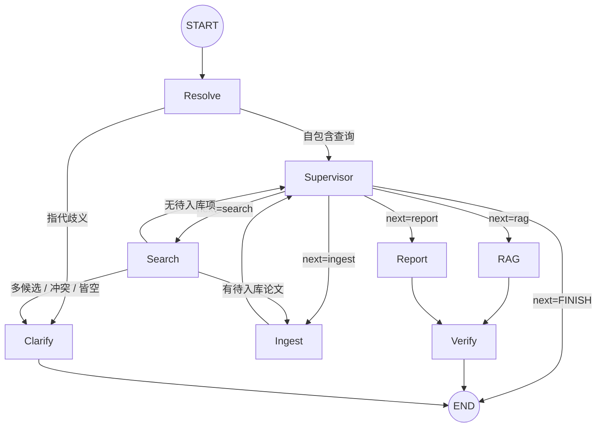
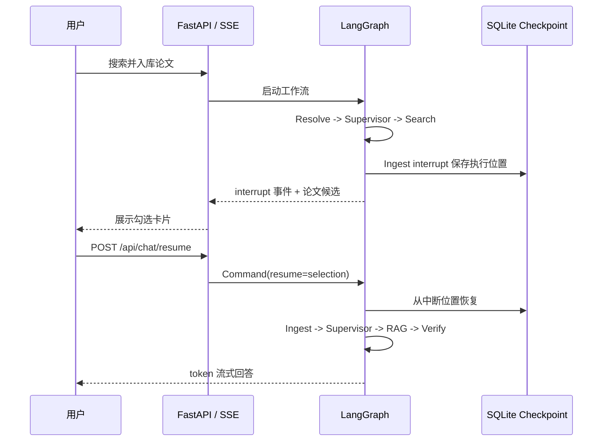
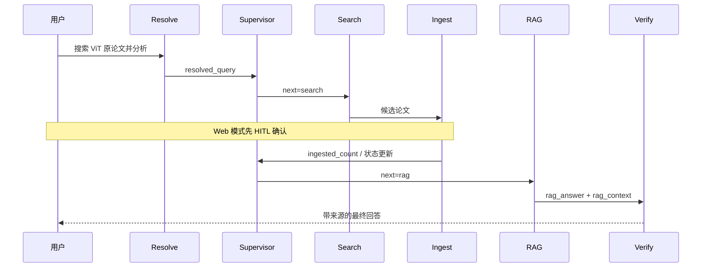
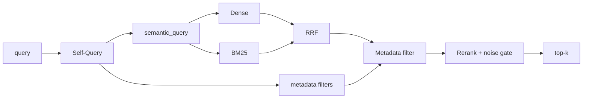
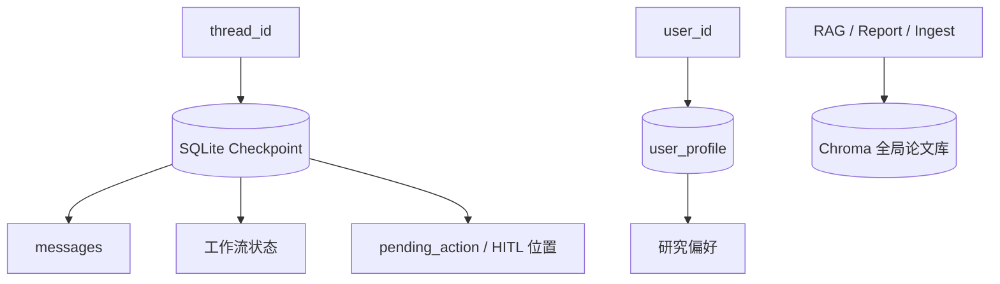
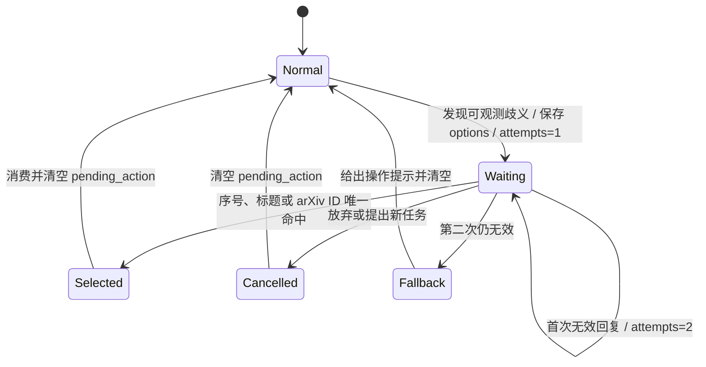

# OpenDetect_AI 面试说明

这份文档只描述当前架构、已经验证的结果和仍然存在的边界。安装与使用方式见 [README.md](README.md)。

## 1. 一分钟介绍

OpenDetect_AI 是一个面向 AI 研究者的文献工作流系统。用户可以用自然语言搜索论文、选择入库、基于论文内容问答并生成综述。系统用 LangGraph 管理多 Agent 状态，用 MCP 调用 OpenAlex 和 ArXiv，用 Chroma、BM25 和 Rerank 完成检索，并通过 SQLite Checkpointer 支持多轮会话和中断恢复。

这个项目重点不只是“接了几个 Agent”，而是把容易失控的 LLM 行为逐步搬到可验证的结构里：确定性输入用规则解析，语义判断用结构化输出，路由用状态机约束，事实结论用检索与 Verifier 校验，行为变化用 golden set 回归。

## 2. 当前架构



Search 有待入库论文时直接进入 Ingest；Ingest 完成后回 Supervisor；RAG 和 Report 都经 Verify 后结束。Resolve 只连接 START，不会在子 Agent 回流时重复执行。Clarify 是普通对话轮（非 `interrupt`）：反问后收束 END，下一轮 Resolve 确定性解析用户的选择。

Web 入库路径还有一个 HITL 中断。它与 Clarify 不同：HITL 暂停并恢复同一次图运行，Clarify 则结束当前轮、等待下一次用户请求。



### 2.1 多智能体是怎么协作的（Supervisor 模式，面试必答）

这套系统用的是 **Supervisor（主管）多智能体模式**，一句话概括：**一个中枢 LLM 负责"理解意图 + 决定下一步派给谁"，多个专职 Agent 各做一件事，做完回到中枢再决策**。

对比三种常见形态，说清楚为什么选它：

| 形态 | 特点 | 问题 |
|---|---|---|
| 线性 Chain（A→B→C）| 固定顺序 | 不能循环、不能按情况跳转（搜完不一定入库、答完不一定结束）|
| 全自主 Agent（一个 LLM 自己调所有工具）| 灵活 | 容易跑飞、难测试、难解释，路由不可控 |
| **Supervisor 多智能体（本项目）** | 中枢路由 + 专职子 Agent | 兼顾灵活与可控：能循环/条件跳转，但下一步只能是白名单里的节点 |

**协作的三条主线**（记住这三条就能讲清楚流程）：

1. **每轮先过 Resolve**（入口解析），再进 Supervisor（路由决策），Supervisor 用 `next` 字段把控制权交给某个子 Agent。
2. **需要继续编排的节点才回 Supervisor**：Ingest 入库后回到中枢继续决策；RAG/Report 已产出最终内容时直接结束。Search 有结果时通过确定性边直连 Ingest。
3. **能确定性判断的转移不进 LLM**：比如"搜到论文就去入库""已经回答过就结束"由代码里的条件边直接决定，只有真正需要理解自然语言的地方才调模型。

> 🎯 **背诵**：Supervisor 模式 = 会读状态的路由器 + 一堆专职工人；LLM 负责"理解与分派"，状态机负责"确定性流转"。

### 2.2 各 Agent 逐个详解（重点记忆）

八个节点，每个都用同一套模板记：**职责 / 触发 / 输入→输出 / 关键实现 / 面试考点 / 一句话背诵**。

---

**① Supervisor（调度中枢）**
- **职责**：读当前状态，决定下一步路由到哪个 Agent。
- **触发**：Resolve 之后每轮进入；任何子 Agent 完成后回流到它。
- **输入 → 输出**：`resolved_query` + 工作流状态（已搜数、已入库数、待入库数、是否已回答…）→ `RouteDecision{next, reason, reply}`。
- **关键实现**：`with_structured_output(RouteDecision, method="function_calling")`，`next` 是 `Literal` 白名单（search/ingest/rag/report/FINISH），从根上杜绝手撕 JSON；DeepSeek 偶发不支持工具调用时回退裸 JSON 解析（双保险）。`has_rag_answer / final_report / error` 在代码里**确定性短路**，不进 LLM。
- **面试考点**：为什么路由用结构化输出而不是让模型自由文本回答——因为**路由目标必须合法可枚举**，`Literal` 让非法路由从类型上不可能出现。
- 🎯 **背诵**：Supervisor 只做两件事——理解用户要干嘛、把活派给对的 Agent，且只能派给白名单里的。

**② Resolve（上游查询解析）**
- **职责**：把"好啊 / 还有吗 / 它呢"这类**省略、指代、确认**式输入，解析成**自包含**的 `resolved_query`。
- **触发**：每轮入口执行一次（`START→resolve`），子 Agent 回流不再经过它。
- **输入 → 输出**：`user_query` + 历史 messages + `pending_action` → `resolved_query`（不覆写原始输入）。
- **关键实现**：两道**确定性闸门**守成本红线——① 有待确认动作时，"好啊/不用了"用词表+贪心匹配判定（**0 次 LLM**）；② 只有含"还有吗/它/更多"等指代标记才调 **1 次** LLM 改写；普通自包含问题直接透传（**0 次**）。
- **面试考点**：为什么单独抽一个入口节点——**指代消解只做一次、放上游**，下游 Search/RAG 只面对干净问题，不各自再猜一遍；且用确定性闸门保证"独立节点不会变成每条消息固定多一次 LLM 调用"。
- 🎯 **背诵**：Resolve = 把话补全成"不看上文也懂"的问题；普通问题 0 成本，只有指代才花 1 次模型。

**③ Search（论文搜索）**
- **职责**：根据需求找论文，结果写入 `search_results`。
- **触发**：Supervisor 路由 `next=search`。
- **输入 → 输出**：`resolved_query` → 论文列表（标题/作者/arXiv ID/PDF 链接）。
- **关键实现**：三段式——① 用户明确给的 arXiv ID/链接用**正则**直接识别（不进 LLM、零幻觉）；② 没给 ID 才用 `SearchIntent` 结构化判断"精确标题 vs 主题"；③ **不让模型回忆 arXiv ID**，ID 一律由 OpenAlex/ArXiv 后端返回（治幻觉）。
- **面试考点**：为什么把"确定性能做的"从 Prompt 里搬出来——旧写法一个大 Prompt 枚举情况 A~F，规则无界增长、改一条不知道会不会弄坏别的；拆成"正则 + 结构化分类 + 后端校验"后，能出错的面小一个量级。
- 🎯 **背诵**：Search = 正则认 ID、模型判标题还是主题、后端定事实；模型绝不编 arXiv 号。

**④ Ingest（入库）**
- **职责**：下载论文 PDF、解析、分块、生成 embedding，写入 Chroma 向量库。
- **触发**：Search 有待入库论文时，由**确定性边**直连（省一次 Supervisor LLM）。
- **输入 → 输出**：`papers_to_ingest` → 写入 Chroma，更新 `ingested_count`。
- **关键实现**：Web 路径入库前调用通用 `approval_required`（非法选择默认拒绝、TTL、审计、幂等恢复）；上传/下载有大小、MIME、文件头、页数和 HTTPS 域名白名单限制；正文按页分块，表格转 Markdown 并关联表号/标题/引用，图片关联 bbox/xref、图注和跨页正文引用；`parser_version` 支持旧索引升级；确定性 chunk ID 保证幂等；写入后使 BM25 缓存失效；下载重试有上限。
- **面试考点**：为什么要 HITL——**防止不相关论文污染全局知识库**，也给用户对"入什么"的控制权。
- 🎯 **背诵**：Ingest = 下载→解析→分块→embedding→入库；幂等 ID、HITL 确认、重试有上限。

**PDF 能力边界**：当前是版面感知的文本 RAG，不是完整多模态理解。表格通过 PyMuPDF
边界检测转为 Markdown，保留表号、标题、页码与正文引用；图片通过坐标距离关联图注，保存
bbox/xref/尺寸和跨页引用，矢量图也能以图注语义块存在。复杂无边框/合并/跨页表格、多个
相邻子图仍可能被启发式错误关联；图片像素不送视觉模型，扫描页没有 OCR。面试时应明确：
当前能回答“论文如何描述图 2”，不能声称能读懂图 2 中未被文字描述的曲线细节。

**⑤ RAG（检索问答）**
- **职责**：从向量库召回相关片段，生成**带出处**的回答。
- **触发**：Supervisor 路由 `next=rag`（知识问题 + 库非空）。
- **输入 → 输出**：`resolved_query` → 召回片段 `rag_context` + `rag_answer`。
- **关键实现**：走完整检索管线（Self-Query → Hybrid(Dense+BM25)+RRF → 元数据过滤 → Rerank 去噪）；答案逐句标来源；库里没有相关论文时**如实说"没有"并提议搜索**，绝不用模型自身知识编造。
- **面试考点**：这是"答案有出处"产品约束的落点——**文献研究助手宁可说没有，也不给一个看似对但无法溯源的答案**。
- 🎯 **背诵**：RAG = 先检索后回答、句句有出处；查不到就提议去搜，不瞎编。

**⑥ Report（综述生成）**
- **职责**：基于已入库论文生成结构化综述 / 对比表 / 研究脉络。
- **触发**：Supervisor 路由 `next=report`（用户要综述 + 库非空）。
- **输入 → 输出**：`resolved_query` + 已入库论文 + 更多召回片段（k=8）→ `final_report`。
- **关键实现**：召回比 RAG 更多上下文（综述需要广度）；同样只基于已入库内容，不编数据。
- 🎯 **背诵**：Report = 综述版 RAG，召回更多、输出结构化，仍然只基于库里内容。

**⑦ Verify（事实性校验）**
- **职责**：RAG 回答生成后，检查论断是否有检索证据支撑。
- **触发**：固定边 `rag → verify → END`。
- **输入 → 输出**：`rag_answer` + `rag_context` → 通过则放行，不足则在回答后附核验提示。
- **关键实现**：无检索内容时不花 LLM 直接拒答；规则核对引用标题，LLM 判断证据充分性和无支撑论断；校验服务异常时保留回答但追加“未完成核验”提示并返回结构化状态。
- **面试考点**：这是“你怎么防 RAG 幻觉”的直接答案，比再加一个总结 Agent 更有价值；显式降级体现“质量增强层不该成为单点故障，也不能把未知伪装成通过”。
- 🎯 **背诵**：Verify = RAG 之后的事实关卡；有支撑放行、无支撑加提示、自己坏了也不挡路。

**⑧ Clarify（主动澄清）**
- **职责**：当指代有多个可指对象、标题有多个接近候选、标题与 ID 冲突、或两后端都查不到时，**反问用户**而不是瞎猜。
- **触发**：`resolve → clarify`（指代歧义）或 `search → clarify`（多候选/冲突/皆空）。
- **输入 → 输出**：判定出的澄清决策 → 带序号的问题（作为本轮答案）+ `pending_action(kind="clarification")`。
- **关键实现**：**普通对话轮**（非 `interrupt`），问完即结束；下一轮 Resolve 用确定性规则解析回复（序号/标题/ID→选中；越界不默认第一项；最多问两次后兜底）。判定信号必须**可观测/可 grounding**，不信模型自报置信度。
- **面试考点**：为什么克制——**主动澄清误触发会直接打断用户**，所以第一版只用能从上下文、候选池、工具返回中验证的信号，且评测重点盯"不该澄清的误触发率"（当前 0%）。
- 🎯 **背诵**：Clarify = 不确定就反问、不瞎猜；只在能"看得见的歧义"下触发，最多问两次。

## 3. 一次完整请求如何执行

以“帮我搜索首次提出 ViT 的论文”为例：

1. Resolve 判断输入已经自包含，直接写入 `resolved_query`，不调用 LLM。
2. Supervisor 输出结构化路由 `next=search`。
3. SearchIntent 判断这是 `exact_title`，生成规范英文标题。
4. OpenAlex 返回论文事实信息；找不到时再由 ArXiv MCP 补充。
5. Web 模式在 Ingest 前暂停，让用户选择论文。
6. Ingest 下载 PDF、解析、分块、生成 embedding 并写入 Chroma。
7. Supervisor 根据原始任务和当前状态决定继续 RAG、Report 或结束。
8. RAG 从论文库召回片段，生成带来源的回答；Verifier 检查论断是否有检索证据。

这里没有“ViT -> 2010.11929”的硬编码表。模型只负责识别标题意图，arXiv ID 必须来自用户明确输入或搜索后端。



## 4. 核心状态

`AgentState` 中最关键的字段：

| 字段 | 作用 |
|---|---|
| `messages` | 会话内消息历史，追加合并 |
| `user_query` | 本轮原始输入，永不覆盖 |
| `resolved_query` | Resolve 生成的自包含问题 |
| `pending_action` | 等待用户确认的搜索或澄清动作 |
| `next` | Supervisor 的下一节点 |
| `search_results` | Search 返回的论文 |
| `papers_to_ingest` | 待入库论文 |
| `rag_context` | 检索片段 |
| `rag_answer` | RAG 最终回答 |
| `failed_papers` | 可重试的失败论文 |
| `thread_id` / `user_id` | 会话隔离与用户偏好隔离 |

下游通过 `effective_query(state)` 读取 `resolved_query or user_query`，既能消费改写结果，也保留原始输入用于日志、评测和问题回溯。

## 5. 关键设计决策

### 5.1 把确定性问题移出 Prompt

旧式做法是在一个 Prompt 里枚举 arXiv ID、著名论文、标题、主题和指代等情况。问题是规则会持续增长，改一条也无法知道是否破坏其他分支。

当前分工：

| 子任务 | 机制 |
|---|---|
| 用户明确提供 arXiv ID/URL | 正则 |
| 省略、指代、确认承接 | Resolve |
| 精确标题或主题搜索 | `SearchIntent` 结构化输出 |
| 论文 ID、标题和作者事实 | OpenAlex/ArXiv |
| 图中确定性状态转移 | Python 条件边 |
| 回答是否有来源 | Retriever + Verifier |

核心讲法：Prompt 仍然有用，但只负责把自然语言编译成受约束结构，不再独自承担整个 Agent 的正确性。

### 5.2 查询改写只做一次

Resolve 位于每轮入口，职责是生成自包含查询：

- 普通完整问题：直接透传，0 次改写调用；
- 上一轮存在 `pending_action`，本轮明确确认或拒绝：确定性处理，0 次调用；
- “还有吗”“它呢”等依赖上下文的输入：调用 1 次 LLM 改写；
- Search、RAG 和 Report 只消费结果，不再各自做一次指代消解。

状态同时保存 `user_query` 和 `resolved_query`，避免为了方便下游而丢失原始输入。

### 5.3 pending_action 是业务状态，不是聊天文本猜测

当系统提出“要我搜索相关论文吗”时，会写入：

```python
{"kind": "search", "query": "帮我搜索并入库与 LoRA 相关的论文"}
```

下一轮用户说“好啊”，Resolve 直接消费该动作并清空。系统不需要重新扫描上一轮自然语言来猜“好啊”确认了什么。

Clarify 设计继续复用同一个字段，通过 `kind="clarification"` 区分，不再引入第二份 `last_system_offer`。

### 5.4 LLM 决策与状态机各做擅长的事

Supervisor 用 LLM 理解用户任务，但输出受 Pydantic 和 Literal 约束。确定性的转移不再调用 LLM：

- Search 有待入库项 -> Ingest；
- RAG 已生成答案 -> FINISH；
- Report 已生成内容 -> FINISH；
- Search 本轮已经执行 -> 禁止重复搜索；
- 失败论文超过上限 -> 不再重试。

这样可以减少成本，并降低路由环和重复执行风险。

### 5.5 “答案有出处”是产品约束

系统定位是文献研究助手，不是通用聊天机器人。知识问题统一进入 RAG：

- 检索到相关论文：基于片段回答并标注来源；
- 文献不足：明确说明并提出搜索建议；
- 不使用模型参数知识补全一个看似正确但无法追溯的答案。

AnswerGuard 是第二道保护。规则层先核对回答中的论文标题是否真实出现在本轮检索结果；LLM 同时读取用户问题、完整回答与完整证据，逐条输出 `claim -> evidence_ids`，再判断证据是否充分。证据不足时拒答并写入搜索动作，部分不通过时降低置信度，核验服务故障时保留回答但显式标记 `unavailable`，不会伪装成通过。核验结果按 message ID 覆盖草稿，不让未通过内容进入后续上下文和长期记忆。

## 6. 搜索链路

### 6.1 确定性 arXiv 解析

支持：

- `2010.11929`
- `2010.11929v2`
- `https://arxiv.org/abs/2010.11929`
- `https://arxiv.org/pdf/2010.11929v2.pdf`
- `hep-th/9901001`

正则只识别用户明确提供的 ID，不从论文名称推断 ID。

### 6.2 SearchIntent

未提供 ID 时，模型只输出：

```python
class SearchIntent(BaseModel):
    mode: Literal["exact_title", "topic"]
    query: str
    reason: str = ""
```

`exact_title` 的 query 是规范英文标题，`topic` 的 query 是英文主题短语。结构化输出失败时退化为 `topic + 原查询`。

### 6.3 后端策略

- arXiv ID：OpenAlex 精确查找，ArXiv 补充；
- 精确标题：OpenAlex 标题查询，ArXiv 补充；
- 主题：OpenAlex 返回多篇论文。

OpenAlex 是主要后端，ArXiv MCP 主要处理精确查询补充。MCP 工具列表有进程内缓存，避免每次请求重新建立连接。

## 7. RAG 检索设计



### 为什么不是只做向量检索

Dense 对语义相似有效，但对论文缩写、模型名和精确术语不稳定；BM25 正好补这一点。两者分数尺度不同，因此用 RRF 融合排名，而不是直接加分。

### Self-Query 的作用

“2023 年后某作者的论文”包含语义主题和结构化约束。Self-Query 将年份、作者、标题约束抽出，再由 Python 做元数据过滤，避免约束词污染向量查询。

### Rerank 的收益和代价

Rerank 能过滤“语义表面接近、领域实际不相关”的片段。仓库内受控基准显示 Precision 和上下文相关性提升、跨领域噪音下降，但每次检索增加 Self-Query 与 Rerank 两次 LLM 调用，延迟从毫秒级上升到秒级。

这是明确的质量/成本权衡，不应只汇报质量提升。

## 8. 记忆与持久化

系统有四种不同的数据：

| 类型 | 存储 | 键 | 说明 |
|---|---|---|---|
| 对话窗口 | `messages` | `thread_id` | 当前会话语义上下文 |
| 工作流 checkpoint | SQLite | `thread_id` | 状态、节点位置、HITL 恢复 |
| 用户偏好 | SQLite `user_profile` | `user_id` | 跨会话研究兴趣 |
| 论文内容 | Chroma | 当前全局 | RAG 知识库 |

需要明确区分“checkpoint 是长期记忆”和“用户偏好是长期记忆”的说法：checkpoint 保存的是工作流状态；`user_profile` 才是按用户隔离、跨会话复用的偏好数据。

长期记忆只保存明确偏好而不是全部原始对话。用户可以查看条目及其 `source/updated_at`、关闭或重新开启记忆、设置 TTL、主动删除。关闭期间系统不读、不写，也不启动异步偏好提取。



## 9. Human-in-the-Loop 与流式输出

### 通用审批机制

`approval_required(action, payload, reason, thread_id, user_id, idempotency_key, ttl)` 将审批建模为工作流中的可恢复状态，而不是前端弹窗。它先持久化 pending 审计，再调用 LangGraph `interrupt`；用户决定后，`Command(resume=selection)` 从同一 checkpoint 继续执行。重复重放复用第一次决定，超时或审计不可用默认拒绝，API 也拒绝无 pending 和跨用户恢复。

当前可恢复 interrupt 接入搜索结果入库；本地 PDF 上传是用户主动发起的显式批准，同样写入审批审计，但不额外弹第二次确认。同一原语可复用于批量删除、报告导出和高成本工具调用，但这些业务动作尚未实现，面试时不能说成已全部上线。

### 双流 SSE

后端同时消费：

- `values`：节点状态变化，用于 Search/Ingest/RAG 进度；
- `messages`：模型生成事件仅在服务端作为草稿消费，不在核验前发送给客户端。

这样可以把“系统正在做什么”和“核验后的最终回答”分开处理。AnswerGuard 完成后，后端才发送带 `verified=true` 的正文块，避免流式体验绕过事实关卡。

## 10. 真实故障与修复

### 10.1 SearchIntent 结果被计算后丢弃

旧代码先生成了带上下文语义的 `search_value`，但主题搜索时又从原始 `user_query` 重新提词。日志看起来意图识别正确，真正传给后端的却是另一份输入。

修复方式：Search 只使用 `intent.query`，并用回归测试检查 MCP 的实际调用参数，而不是只断言中间对象。

可讲结论：结构化解析不是写进日志就完成了，必须测试解析结果是否真正被消费者使用。

### 10.2 messages 里从未写入 HumanMessage

原流程只追加 AIMessage，导致 `build_context_str` 看似存在，实际长期返回空上下文。Resolve 现在负责每轮写入一个 HumanMessage，API 侧保证 HumanMessage 不会被当作助手答案回显。

可讲结论：功能代码“存在”不代表链路生效；测试应覆盖真实数据流，而不是只测 helper。

### 10.3 “好啊”被当成打招呼

第一轮 RAG 提议搜索 LoRA，第二轮用户只回复“好啊”。把承接逻辑写在 Prompt 中既脆弱，又要求重新从聊天文本恢复业务动作。

修复方式：提议时写入 `pending_action`；确认词用确定性规则消费。该路径经过真实 HTTP、SSE、checkpoint 和日志验证，并刻意在两轮之间重启服务，证明状态来自 SQLite 而不是进程内存。

LoRA 确认链与“ViT -> 还有吗”的指代测试使用不同 thread，不能合并描述为同一条对话。

### 10.4 入库重试边界

不可下载的付费墙论文如果没有 arXiv ID，反复重试没有意义；临时网络失败则可能恢复。当前策略是前者直接放弃，后者有限重试，并用 `search_attempted`、`retry_count` 和确定性边约束循环。

## 11. 评测策略

| 层级 | 评测 | 主要问题 |
|---|---|---|
| 单元测试 | `make test` | 确定性规则、状态更新和节点分支是否正确 |
| 集成测试 | `make integration-tests` | 最短在线链路是否可运行 |
| 检索评测 | `make eval` | Hit/MRR/Precision/Recall/nDCG/Noise、P50/P95、调用数与失败率 |
| 意图评测 | `make intent-eval` | Resolve -> SearchIntent 是否保持语义和成本边界 |
| 澄清评测 | `make clarify-eval` | 是否只在可观测歧义下打断用户 |
| 路由评测 | `make route-eval` | Supervisor `(query, state) -> next` 是否正确，作为是否上 TaskSpec 的判据 |

意图 golden set 不只测分类器，而是测 `Resolve -> SearchIntent` 全链路。这样查询改写职责移动后，重构前后仍可比较。

RAG 检索脚本支持外部 JSONL 和多 gold；没有真实人工标注集时只报告“小型受控基准”，不把合成结果包装成线上收益。简历中的 X%、Y%、Z ms 必须在 50～100 条真实问题完成标注和复跑后填写。最终答案还应单独聚合 AnswerGuard 的 citation precision、faithfulness 与拒答准确率，当前仓库已产生逐请求结构化核验结果，但尚未声称有大规模答案级基准。

Clarify 评测优先优化精度：宁可少问，也不能频繁误触发。当前 24 条 golden 覆盖指代 grounding、标题候选、实体冲突、空结果和下一轮选择解析。

## 12. Clarify 主动澄清（已接入 Graph）

Clarify 的判定逻辑先在离线 golden set 上做到 24/24、校准好阈值，再接入控制流：Resolve/Search 两处条件边 + 独立 `clarify` 节点。坚持「先评测后控制流」，接线时只需专注路由与验收，不用一边搭骨架一边猜逻辑对不对。

### 第一版信号

| 信号 | 依据 |
|---|---|
| `ambiguous_reference` | 至少两个候选实体能用 `evidence + message_index` 在历史中验证 |
| `multiple_papers` | 去重后至少两个标题同时超过绝对下限，且与第一名分差足够小 |
| `entity_conflict` | 用户标题与明确 arXiv ID 返回标题差异过大 |
| `exact_title_not_found` | 两个后端都成功返回空结果 |

不使用模型自报 confidence。`low_relevance` 暂缓，因为检索层尚未统一保留可比较的重排分数。

### 选择与循环保护

`pending_action(kind="clarification")` 保存问题、选项和已展示次数。下一轮通过序号、标题或 arXiv ID 确定性选择；拒绝和新任务会清空旧动作；越界序号不会默认第一项。最多展示两次澄清问题，仍不明确则给出可操作提示并清空。



### 接入实现：控制流与候选池

- **控制流**：`resolve → (clarify | supervisor)`、`search → (clarify | ingest | supervisor)`；`clarify` 节点把带序号的问题作为本轮答案返回并收束到 END（普通对话轮，非 `interrupt`）。下一轮 Resolve 解析用户选择。
- **候选池**（原来的接入前置）：`get_paper_by_title` 只回一篇、观测不到多候选，改用 `search_papers(max_results=5)` 取候选池，并严格区分 `ok`（有候选）/ `empty`（成功但无候选）/ `error`（超时或后端失败）——只有 `empty` 才触发「没找到」，后端错误不伪装成语义不匹配。
- **验收**：单测 56 全绿（含 resolve 澄清选择、search 多候选路由）；`clarify-eval` 24/24、误触发率 0%；`intent-eval` 仍 21/21（Resolve 改用引用解析后成本红线不变，改写调用仍恰为指代类用例数）；真实模型 smoke 跑通「多实体指代 → 澄清 → 选择」。真实服务器跨进程重启验收也已通过：澄清选项、序号映射、`attempts` 和兜底清空均从 checkpoint 正确恢复。

## 13. 工程权衡

### 为什么不直接让一个更强模型处理全部逻辑

模型升级不能解决不可验证、状态重复和事实来源不可靠的问题。正则、Schema、状态机和工具校验分别提供模型无法替代的确定性边界。

### 为什么不是所有输入都走 Resolve LLM

大多数输入本来已经自包含。无条件增加一次模型调用会提高成本和延迟。当前只有检测到指代/省略时才调用，确认和拒绝由规则处理。

### 为什么 Verifier 故障时采用显式降级

Verifier 不应成为单点故障，但静默放行会把“未核验”伪装成“已通过”。当前策略保留主回答，同时追加核验不可用提示，并返回 `verification.status=unavailable` 和未知置信度；证据本身不足则直接拒答。这样区分“答案不可用”和“校验器不可用”。

### 为什么 Clarify 也要克制

主动澄清的误触发会直接打断用户。第一版只采用可以从上下文、候选池和工具返回中验证的信号，不把模型自报置信度当事实。

### 当前最明显的生产差距

- SQLite 和本地 Chroma 不适合高并发多实例；
- 论文库没有按用户隔离；
- `PaperMeta` checkpoint 序列化存在未来版本兼容警告；
- 外部 PDF 下载受来源站点限流；当前已限制大小/MIME/页数/HTTPS 白名单并设置超时重试，但没有杀毒与沙箱解析；
- 评测数据量仍小；
- CORS 已改为显式来源，但仍缺少真实认证授权；`user_id` 不是可信身份；
- MCP 仍有同步包装和事件循环生命周期债务；生产应使用异步生命周期；
- 多实例部署需要 Postgres/Redis Checkpointer，不能继续用单机 SQLite。

## 14. 高频面试问答

### 为什么使用 LangGraph，而不是普通 Chain

任务包含条件路由、循环、共享状态、中断恢复和多轮 checkpoint，不是单向流水线。LangGraph 能显式表示这些控制流，并让每个节点的输入输出可测试。

### 为什么使用 MCP

MCP 将搜索能力定义为标准工具，Agent 不需要知道底层是本地 Python、远程 HTTP 还是未来的其他数据源。代价是多一层协议和连接管理，因此项目对工具列表做了缓存。

### 多个 Agent 之间怎么传递数据

不靠互相调用，而是**共享一个 `AgentState`**（LangGraph 的 StateGraph）。每个节点是一个纯函数 `state -> dict`，返回的 dict 会**合并**进全局状态（`messages` 用追加合并，其余字段覆盖）。比如 Search 返回 `{"search_results": [...], "papers_to_ingest": [...]}`，Ingest 就能从状态里读到。**好处**：节点之间解耦、每个节点的输入输出都能单独测试，也天然支持 checkpoint 持久化。

### 某个 Agent 失败了会怎样

分三种处理，都不让单点故障拖垮整体：
- **可降级的**（Self-Query、Rerank、Resolve 改写）→ 退回更简单路径；Verifier 故障保留主回答但显式标记未核验；
- **致命且无可用内容**（如库空又彻底搜不到）→ Supervisor 读 `error` 字段**确定性短路**到 FINISH，给用户明确提示而不是卡住；
- **可重试的**（临时网络失败）→ `retry_count` 限制次数，付费墙论文直接放弃，用 `search_attempted` 防重复搜索。

### 为什么是 Supervisor 模式，而不是让一个 Agent 自己调所有工具

全自主单 Agent 灵活但不可控：路由不可枚举、容易在工具间反复横跳、出错难定位。Supervisor 模式把"决策"和"执行"分开——中枢只输出**白名单内**的下一步，子 Agent 只干一件事，因此**可控（路由合法）、可测（每个节点独立）、可解释（每步有 reason）**。这也是它比线性 Chain 强的地方：Chain 顺序写死，而这里能按状态循环和跳转。

### 如何防止死循环

使用 `search_attempted` 禁止同轮重复搜索、`retry_count` 限制论文重试、结果字段触发确定性 FINISH，以及 Clarify 的最大展示次数。Graph 的 `recursion_limit` 是最后保护，不是主要业务策略。

### 如何控制幻觉

查询侧不让模型生成事实 ID；回答侧只使用检索片段；输出侧由 Verifier 检查支撑；文献不足时明确拒答并提出搜索建议。

### 如何证明优化有效

分别报告检索质量、延迟和 LLM 调用数；语义重构使用 golden set 防回归；跨轮状态用真实进程重启验证。不能只用几个演示问题证明“效果更好”。

### 下一步为什么不是立即微调

当前主要问题是职责混杂、状态缺失和工具结果未验证，这些不是微调优先解决的问题。先建立结构化任务、澄清和真实评测，再根据稳定错误样本决定是否微调。

### 为什么暂不引入统一 TaskSpec

有人会问「为什么不把 intent、query、过滤条件合成一个大 TaskSpec 统一路由」。我的做法是**先量化再决定**：建了 `route-eval`（`(resolved_query, 工作流状态) -> expected_next`），当前 17/17，说明 Supervisor 路由没有明显、稳定的错误。既然没有证据，就不为不存在的问题造一个「承担所有语义的大对象」。等真实使用中出现稳定误路由、补进 route-eval 复现后，再从最小 `TaskSpec(intent, query)` 起步，年份/作者过滤仍归 RetrievalPlan、标题/主题仍归 SearchIntent，只有当重复或冲突真的出现才合并。这体现的是「先评测后重构」和「按需演进、不提前抽象」。

## 15. 可直接使用的总结

### 30 秒版本

我做了一个基于 LangGraph 的 AI 文献研究助手，把搜索、入库、RAG 问答和综述串成有状态工作流。工程上重点解决了三个问题：用规则和结构化输出缩小 Prompt 的职责，用 Hybrid + Rerank 和 Verifier 保证答案相关且有出处，用 checkpoint、HITL 和评测集保证多轮流程可恢复、可回归。

### 最值得展开的三个点

1. **语义链重构**：正则、Resolve、SearchIntent 和后端事实校验各归其位。
2. **RAG 质量与成本**：Dense + BM25 + RRF + Rerank 提升相关性，但诚实报告延迟和调用成本。
3. **状态与可靠性**：pending_action、SQLite checkpoint、跨进程重启验证，以及先 golden set 后改控制流。

### 八个 Agent 一句话背诵卡（临考速记）

| Agent | 一句话 |
|---|---|
| Supervisor | 会读状态的路由器：理解意图 + 派活，只能派给白名单节点 |
| Resolve | 把"好啊/它/还有吗"补成自包含问题；普通 0 成本，指代才花 1 次模型 |
| Search | 正则认 ID、模型判"标题还是主题"、后端定事实；模型绝不编 arXiv 号 |
| Ingest | 下载→解析→分块→embedding→入库；幂等 ID、HITL 确认、重试有上限 |
| RAG | 先检索后回答、句句有出处；查不到就提议去搜，不瞎编 |
| Report | 综述版 RAG，召回更多、输出结构化，仍只基于库里内容 |
| Verify | RAG 之后的事实关卡；有支撑放行、无支撑加提示、自己坏了也不挡路 |
| Clarify | 不确定就反问、不瞎猜；只在"看得见的歧义"下触发，最多问两次 |

### 一句话串起整条流程（背这句）

> 用户说话 → **Resolve** 把话补全 → **Supervisor** 读状态决定派谁 → **Search** 找论文 →（HITL 确认）→ **Ingest** 入库 → **Supervisor** 再决策 → **RAG** 基于文献带出处回答 → **Verify** 校验事实 → 结束；中间只要"指代有歧义/搜到多个候选"就先 **Clarify** 反问。
